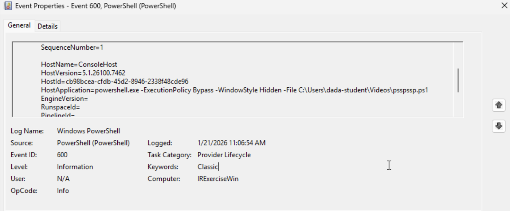

# Active Directory Security Lab

Build, harden, attack, and defend a small Windows/Linux enterprise environment.

I stood up a Windows Server 2022 domain from bare metal, provisioned users and Group
Policy via PowerShell, joined Windows and Linux hosts to the domain, deployed a Wazuh
SIEM, and then worked the environment from the defensive side — auditing it for
misconfigurations and running full incident response against a live compromise.

**Stack:** Windows Server 2022 · Active Directory Domain Services · Group Policy ·
PowerShell · Ubuntu 24.04 · SSSD/Kerberos · Wazuh · Sysinternals

---

## Environment

```
                      team17.lab  (172.16.17.0/24)

   ┌─────────────────────┐      ┌─────────────────────┐
   │  DC                 │      │  Windows 10 LTSC    │
   │  Server 2022        │◄────►│  workstation        │
   │  AD DS · DNS        │      │  domain-joined      │
   │  172.16.17.1        │      │  172.16.17.3        │
   └──────────┬──────────┘      └──────────┬──────────┘
              │                            │
              │        Wazuh agents        │
              └────────────┬───────────────┘
                           ▼
              ┌─────────────────────────┐
              │  Wazuh Manager          │
              │  Ubuntu 24.04 LTS       │
              │  SSSD-joined to realm   │
              │  172.16.17.2            │
              └─────────────────────────┘
```

---

## Contents

| Doc | What it covers |
|---|---|
| [01 — Domain Controller](docs/01-domain-controller.md) | Server 2022 VM, AD DS role, forest promotion, DNS |
| [02 — Identity Provisioning](docs/02-identity-provisioning.md) | Bulk user creation and group membership via PowerShell |
| [03 — Group Policy](docs/03-group-policy.md) | Scenario-driven GPO design across three threat models |
| [04 — Domain Join & SIEM](docs/04-domain-join-and-siem.md) | Windows and Linux domain join, Wazuh deployment |
| [05 — Environment Audit](docs/05-environment-audit.md) | Ten findings across Windows and Linux, with remediation |
| [06 — Windows Incident Response](docs/06-windows-incident-response.md) | Full IR on a credential-theft attack chain |
| [07 — Linux Incident Response](docs/07-linux-incident-response.md) | Live-response triage on a compromised Linux host |

## Scripts

| Script | Purpose |
|---|---|
| [`New-DomainUsers.ps1`](scripts/New-DomainUsers.ps1) | Provision 15 users from a data table, assign descriptions and group membership |
| [`Set-CoreGpo.ps1`](scripts/Set-CoreGpo.ps1) | Build a baseline GPO via registry-backed policy settings |
| [`Set-AuditPolicy.ps1`](scripts/Set-AuditPolicy.ps1) | Enable PowerShell and advanced audit logging for detection coverage |

---

## Highlights

**Incident response on a real attack chain.** A three-stage attack — Startup-folder
persistence, a hidden PowerShell payload, and a decoy batch script — that pulled
Mimikatz from GitHub and staged system files for exfiltration. I reconstructed the chain
from Event Viewer and Autoruns, mapped it to MITRE ATT&CK, and worked it through the
SANS IR framework. Write-up includes an honest lessons-learned section on what I'd do
differently. → [docs/06](docs/06-windows-incident-response.md)



*Event ID 600. The `HostApplication` field preserved the full command line — execution
policy bypassed, window hidden, payload path — even though the script deleted itself
afterward.*

**Defensive audit of a deliberately broken environment.** Ten distinct findings —
anonymous FTP, `PermitRootLogin yes`, an SSH banner pointed at `/etc/shadow`, credential
reuse across every account, disabled Defender — each with impact and a concrete fix.
→ [docs/05](docs/05-environment-audit.md)

**Threat-model-driven Group Policy.** Rather than applying a generic baseline, I built
three separate policy sets for three scenarios (a locked-down point-of-sale terminal, a
remotely administered kiosk in a hostile physical environment, and an isolated malware
analysis workstation) and justified each setting against that scenario's threat model.
→ [docs/03](docs/03-group-policy.md)
