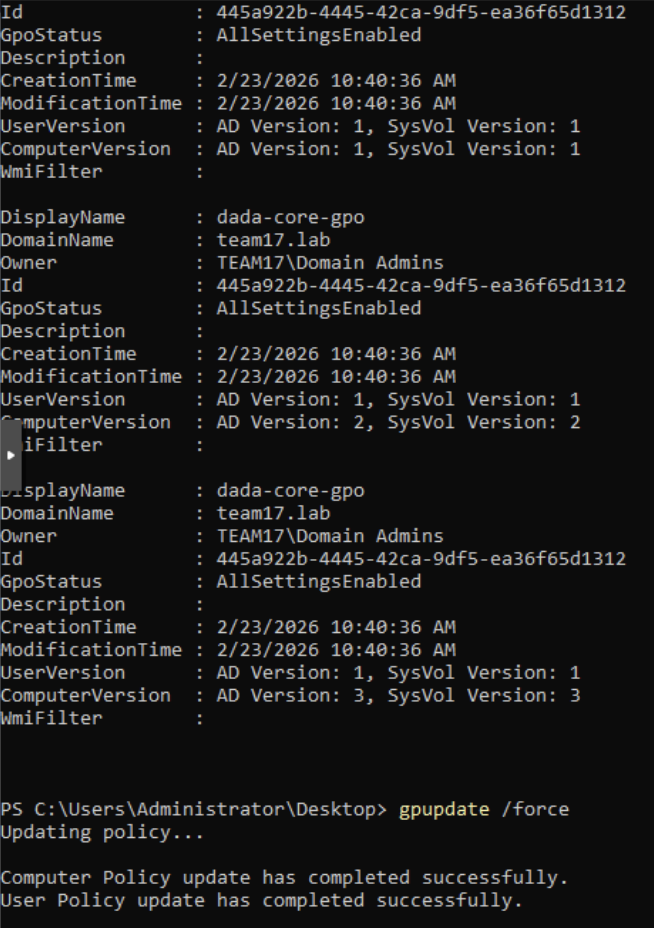
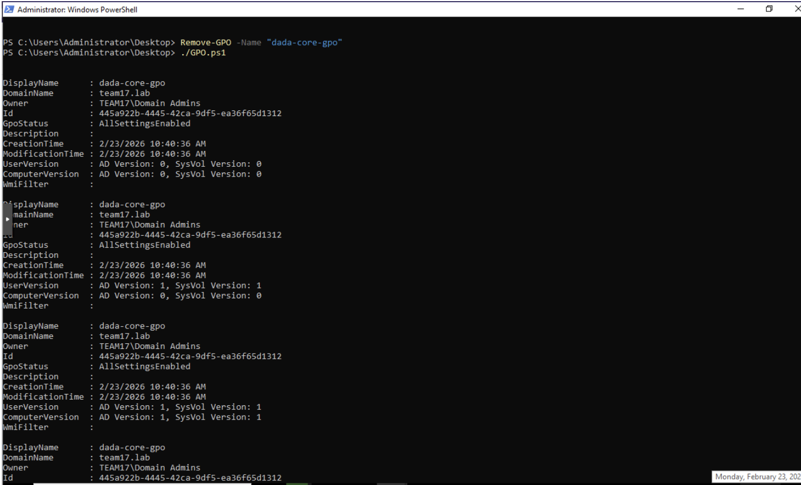

# 03 — Group Policy

Three machines, three threat models, three different policy sets.

The exercise here wasn't "apply a hardening baseline." It was to reason about what each
machine is actually for, who can physically reach it, and what an attacker would do with
it — then pick settings that follow from that.

---

## Scenario A — Point-of-Sale terminal

**Threat model:** Sits on a counter. Customers can reach the keyboard. The only
legitimate use is running the POS application. It has no business talking to anything
outside the local subnet.

| Setting | Rationale |
|---|---|
| **Deny log on locally** → `Guests` | Only employees should authenticate at the console. Blocks walk-up access by anyone not provisioned. |
| **Prevent access to registry editing tools** | Removes `regedit` as an avenue for both accidental damage and deliberate tampering. |
| **Prohibit access to Control Panel and PC settings** | Users can't change system config, install software, or weaken security settings. Keeps the machine at its intended minimum. |
| **Windows Firewall outbound rule** — allow `192.168.1.0/24` only | Payment terminal has no reason to reach the internet. Constrains outbound to the local subnet, which cuts off exfil and C2 in one move. |
| **Remove Run menu from Start menu** | Same logic as the registry lock — eliminates a direct path to executing arbitrary commands and system tools. |

The through-line is reduction of functionality. Every capability the machine doesn't need
for its one job is a capability an attacker can use.

---

## Scenario B — Remotely administered kiosk, hostile physical environment

**Threat model:** Physically located somewhere unsupervised and adversarial. Users may
arrive with bootable USB media. Administrators need remote access over the internet, so
RDP has to stay open — which makes the RDP path itself the thing to harden.

| Setting | Rationale |
|---|---|
| **All Removable Storage classes: Deny all access** | Directly counters bootable USB. Blocks both booting to an alternate OS and bulk data theft to removable media. |
| **Always prompt for password upon connection** | No credential caching on the RDP path. Every session authenticates. Modeled on the VDI access flow I use at work, where credentials plus MFA are required each time. |
| **Allow users to connect remotely using Remote Desktop Services** | Required by the scenario — administrators need internet-facing remote management. Enabled deliberately, then constrained by the two settings around it. |
| **Interactive logon: Machine inactivity limit → 300s** | The on-site admin won't reliably lock the console. Five minutes of idle and it locks itself, which closes the unattended-session window. |
| **Require specific security layer for RDP → SSL** | Forces TLS on remote sessions. Without it, RDP can negotiate down to weaker native encryption, exposing session content in transit. |

Enabling remote access and then hardening it is a more honest exercise than pretending you
can turn it off. The requirement is real; the job is to make it survivable.

---

## Scenario C — Malware analysis workstation

**Threat model:** Inverted. The "threat" is the security stack itself interfering with the
work. This host exists to run malicious code deliberately, and telemetry leaving it is a
disclosure risk rather than a defensive win.

> **These settings are deliberately insecure.** They are correct for an isolated,
> air-gapped analysis host and dangerous anywhere else.

| Setting | Rationale |
|---|---|
| **Turn off Microsoft Defender Antivirus** | Samples get quarantined before they can be observed. AV has to be off for the machine to do its job. |
| **Turn off real-time protection** | Same reason at the process level — real-time scanning kills execution mid-analysis. |
| **Disable Windows Error Reporting** | Crash telemetry from malware execution would ship sample data to Microsoft. Contains analysis artifacts to the host. |
| **Prevent the usage of OneDrive for file storage** | Stops sample files from syncing to cloud storage, which would be both a leak and potentially a ToS violation. |
| **Turn off all balloon notifications** | Removes popups that interrupt observation and can obscure the behavior being watched. |

The non-negotiable precondition, which policy alone can't give you: this host must be
network-isolated and snapshot-restored between samples. The GPO makes analysis possible;
segmentation is what makes it safe.

---

## Deployment

GPOs were created and populated from PowerShell rather than the GUI so the configuration
is reproducible — see [`scripts/Set-CoreGpo.ps1`](../scripts/Set-CoreGpo.ps1). Registry-backed
policy settings go in via `Set-GPRegistryValue`:

```powershell
New-GPO -Name 'core-baseline' -Domain 'team17.lab'

Set-GPRegistryValue -Name 'core-baseline' `
    -Key 'HKEY_CURRENT_USER\Software\Microsoft\Windows\CurrentVersion\Policies\Explorer' `
    -ValueName 'NoRun' -Type DWord -Value 1

gpupdate /force
```



*Tearing down and rebuilding the GPO from script. Each `Set-GPRegistryValue` call
increments `UserVersion` or `ComputerVersion` depending on which side of the policy it
targets, so the version numbers climbing across the output is a useful signal that
settings are actually landing.*



*Final state at ComputerVersion 3, followed by a clean `gpupdate /force` on the client.*

`gpupdate /force` on the client, then confirm with `gpresult /h report.html` to see which
policies actually applied and which were filtered out — worth checking, because a GPO
that's linked but not applying looks identical to one that's working until you go looking.
